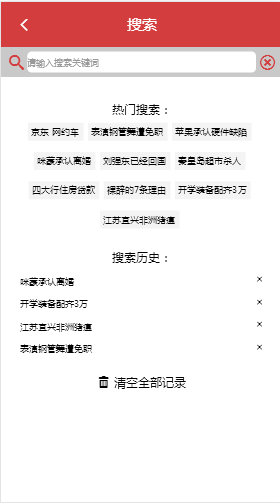
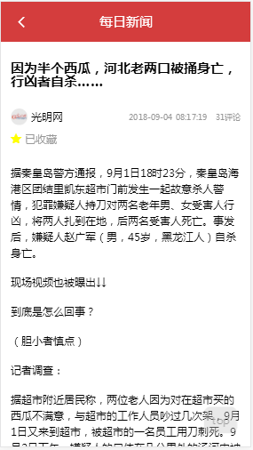

# daily-news

> 这是一个 **vue.js 2.0** 的移动端项目，数据来源为今日头条api接口。

### 技术栈 ###
vue.js 2.0全家桶（vue、vuex、vue-router）
axios、better-scroll、create-keyframe-animation
good-storage、jsonp、vue-lazyload

### 项目效果图 ###

### 下载 ###
git clone https://github.com/Lu1212/daily-news.git

### 安装 ###
npm install

### 运行 (8080端口) ###
npm run dev

### 手机端预览 ###
前提：手机与电脑处于同一WiFi环境下
在命令行窗口输入ipconfig查看本机ip地址
将项目目录中config文件夹下index.js文件中的host改为'0.0.0.0'
重启项目
打开[草料二维码](https://cli.im/)
在输入框输入http://+ 你的ip地址 + :8080/#/，并生成二维码
使用微信扫一扫扫描二维码，预览项目
